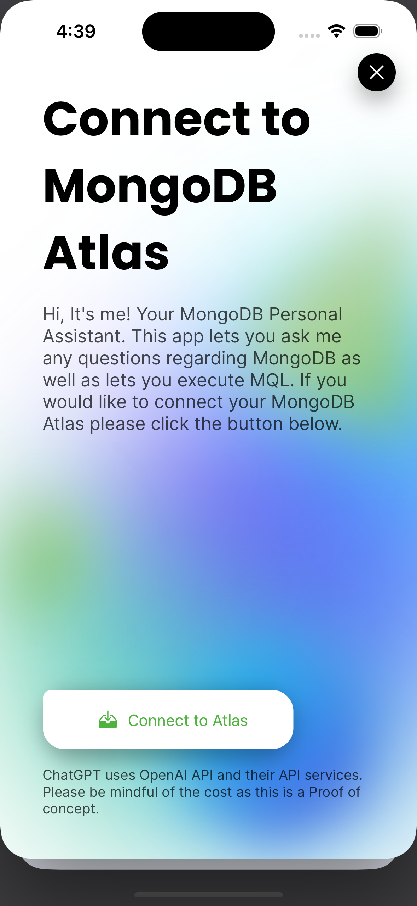
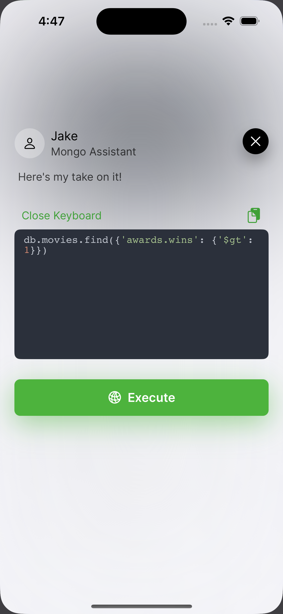
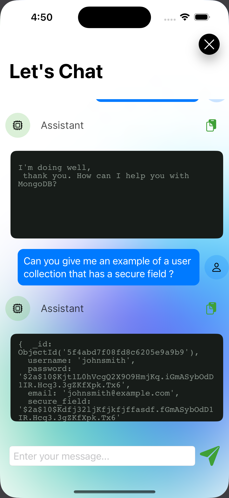

  

Build with <a href="https://codemagic.io/start/" target="_blank">CodeMagic</a> framework

  
  
  

# Mongo Assistant
#### A new way to access and manage your MongoDB

## 🤖 Architecture

## 📝 Description

This application is a client app that can be substituted with any client app whether you are using React or any other cross platform applicaiton. In order to substitute all you have to do is incorporate the following APIs.

## 🏛️ Frameworks and Libraries

- [SwiftUI](http://nestjs.com) - Framework uses Swift to build the app. 
- [XCode](https://www.mongodb.com) - Code Editor
- [Alamofire](https://www.mongodb.com/docs/drivers/node/current) - Rest API
- [CodeEditor](https://github.com/ZeeZide/CodeEditor) - A Library to enable code editors in your app.
- [SwiftyJSON](https://github.com/SwiftyJSON/SwiftyJSON) To Decode JSON responses from Alamofire

## 🧠 FastAPI (Backend)

The brain of Mongo Assistant. Please visit the below link.
 

## 🎮 For local usage:
- Install Xcode https://apps.apple.com/in/app/xcode/id497799835?mt=12
- Clone project to a directory 
- Open MongoGPT3Demo.xcodeproj
- Select a simulator on the top MongoGPT3Demo > Iphone 14 Pro (or any simulator that you like)
- Press play button on top left to build and run
- APIs will not work because the strings are empty for security and cost reasons purposes
**Please DM me for the URL**

## Connect to Atlas

Connect your application to Atlas to execute generate MQL quries

## Generate MQL queries with Natural Language

## Learn more about MongoDB

## License

MIT
