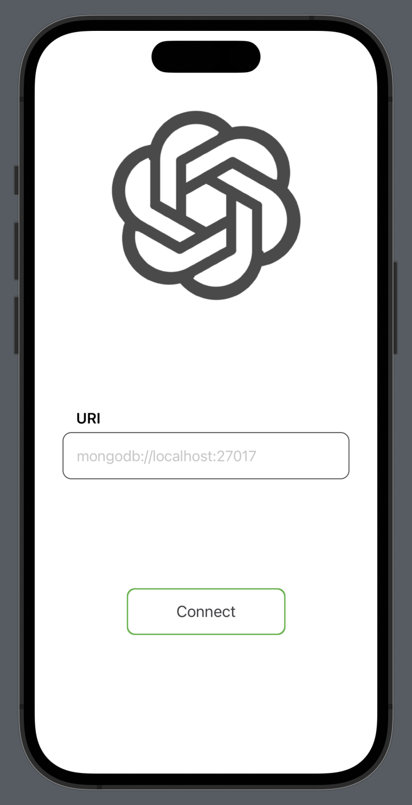

#  MongoDB + GPT3 Query Gen

### How to open

- Install Xcode https://apps.apple.com/in/app/xcode/id497799835?mt=12
- Clone project to a directory 
- Open MongoGPT3Demo.xcodeproj
- Select a simulator on the top MongoGPT3Demo > Iphone 14 Pro (or any simulator that you like)
- Press play button on top left to build and run

### Login Page

